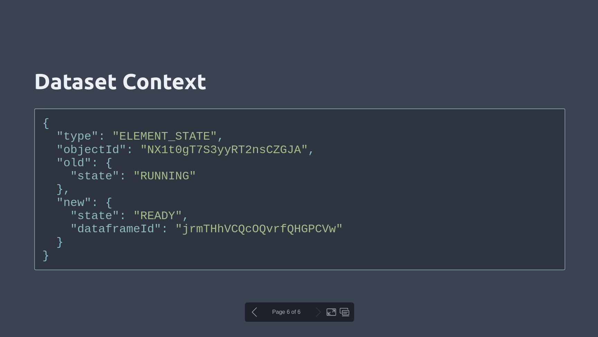
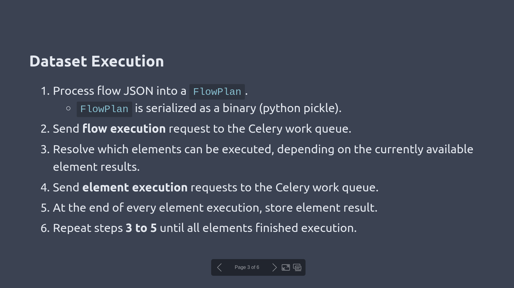
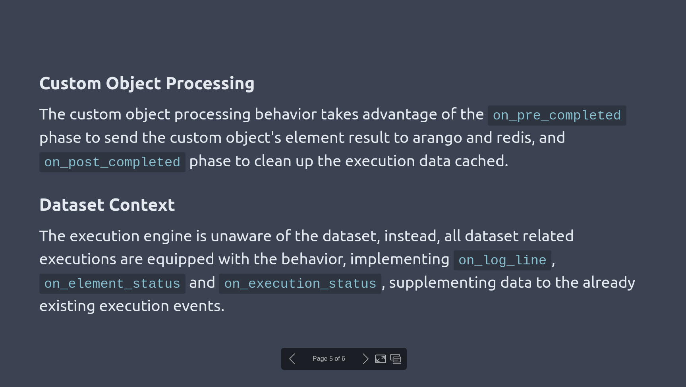

# Marp (Marpit) Nord Theme

This is a [Marp] slides theme based on the [Nord color palette].

* Nord themed code highlighting for code blocks thanks to [nord-highlightjs].

## Usage

With the Visual Studio Code Marp extension, add this to your `.vscode/settings.json` file:

```json
{
    "markdown.marp.themes": [
        "https://raw.githubusercontent.com/mastern2k3/marpit-nord-theme/master/build/nord-theme.css",
    ]
}
```

And then in your slides:

```
---
marp: true
theme: nord
---

# My Nord Themed Slide Title
```

## Examples







[Marp]: https://marp.app/
[Nord color palette]: https://www.nordtheme.com/
[nord-highlightjs]: https://github.com/arcticicestudio/nord-highlightjs
